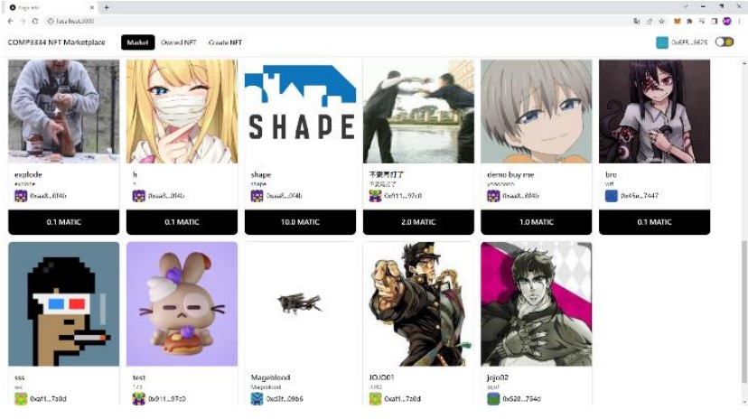

# COMP3334_GroupProject-NFT-Marketplace
 Group13
 <br>

&nbsp;
&nbsp;
&nbsp;
&nbsp;
&nbsp;
&nbsp;

## Introduction
This is a web 3.0 application that allow user to create / Buy / Sell NFT

### Pre Requirement

>[Node.js](https://github.com/joyent/node) + [Yarn](https://yarnpkg.com/getting-started/install) + [Metamask](https://metamask.io/)

First, go to nft-marketplace folder:

```bash
cd nft-marketplace
```

Then, install dependencies:

```bash
yarn
```

For running the test: (if you download from git, you should run the test for generating some files first)
```bash
npx hardhat test
```

For running the React application:
```bash
yarn dev
```


Open [http://localhost:3000](http://localhost:3000) with your browser to see the result.

### Folder structure

    .
    ├── Comp3334                # Subgraph abi setting folder, not important
    ├── nft-marketplace         # Main folder contain all source code
    │   ├── test                # folder contain the hardhat test case code
    │   ├── src                 # folder contain React source code
    │   ├── contracts           # folder contain the NFTMarket.sol code
    │   ├── .env                # environment variable, including the private key of the contract owner
    │   └── ...
    └── ...

## Documentation
[Link](Doc.pdf)

## Screenshots
